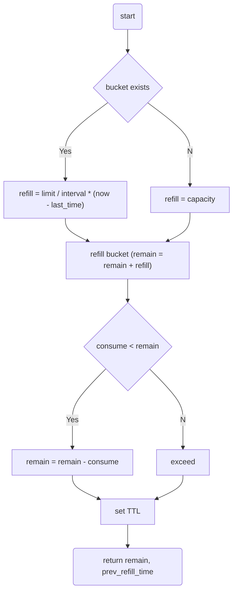

### The algorithm of token in redis

```mermaid
flowchart TD 

A(start) -->  B{bucket exists}
B --Yes--> C["refill = limit / interval * (now - last_time)"]
C --> J[refill token contain]
B --No--> E[refill = capacity]
E --> J["refill bucket (remain = remain + refill)"]
J --> D

D{consume < remain} --Yes--> F[remain = remain - consume]

F --> G[set TTL]

G-->H("return remain, prev_refill_time")


D --No--> I[exceed]
I-->G


```